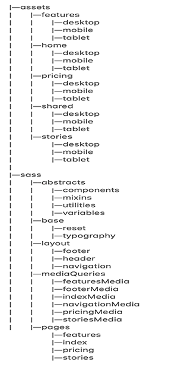

# Photography_Challenge

## About :point_down:

A four page photography site  
 
This project was created from scratch using grid for the main layout and **BEM** method.

Built with a mobile first approach.
 
 
Deployed using [Github-pages](https://colinthedev.github.io/Photography_Challenge/)

## Final Considerations

This project made me much more comfortable using CSS grid.  
 
It was great practice with responsive design.
 
 
I am really happy with how this turned out, and i had a blast making it! :rocket:

## Built With 

* HTML-5
* SCSS
* Javascript

## Key Features

A few key features implemented include:
- :white_check_mark: Toggle button
- :white_check_mark: Hover effects
- :white_check_mark: Fully responsive

## Sections Included

- Home
  - Stories
    - Features
      - Pricing
      
## Folder Structure

